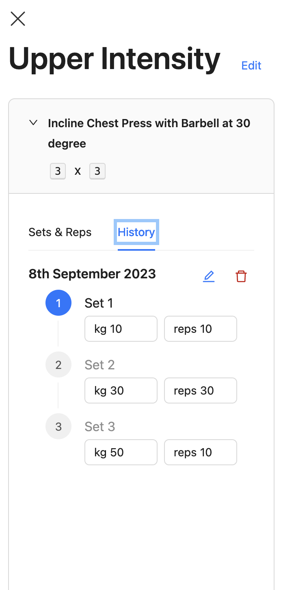

# lifthouse 
This is a personal gym progress tracking app that is tailoured to the way I train. I use to use Google spreedsheets to track my progress, but I found that everything seemed so manual, so I dedicated time to create this application to streamline the same processes I do for my Google Sheets. You probably won't find this useful, or even UI/UX friendly, but it works for me :)

This application is designed for mobile devices but since it is also a PWA, you can view it from the desktop, but please note that the design approach is mobile-first, and I haven't done any real work has been done to make it suitable for the desktop

# Tech Stack
* React
* Supabase (using a postgres db and their authentication servers)
* Firebase for deployment (which you can find (here)[https://lifthouse.web.app/] incase you want to sign up
* Vite PWA plugin

# My Training
Most of my training knowledge comes from [Alex Leonidas](https://www.youtube.com/@AlexLeonidas). He advocates for strength training and building overall strength in various exercises such as SBD, OHP, Z-Press, Zercher Squat, Box Squats, and many more. Highly specialised training to strengthen weak points and build an naturally appleaing body (overemhpaising shoulder, tricep, forearm and neck muscles or known as yoke training). My application is loosely build on exercises that he recommends and rep schemes but in no way his programme e.g. I follow a 4 day split, he recommends full body 2 day split. If you want to know more about him, I suggest going to his [website](https://outalpha.com/)

# Screenshots
<table>
  <tr>
    <td align="center"></td>
    <td align="center"></td>
    <td align="center"></td>
  </tr>
  <tr>
    <td align="center"></td>
    <td align="center"></td>
    <td align="center"></td>
    <td align="center"></td>
  </tr>
  <!-- Add more rows as needed -->
</table>

# Contributions
I don't really accept contributions for this project as it is my own personal application. But I am happy to accept UI/UX recommendations
