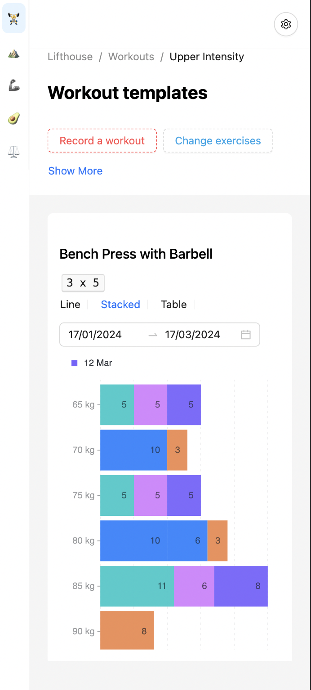
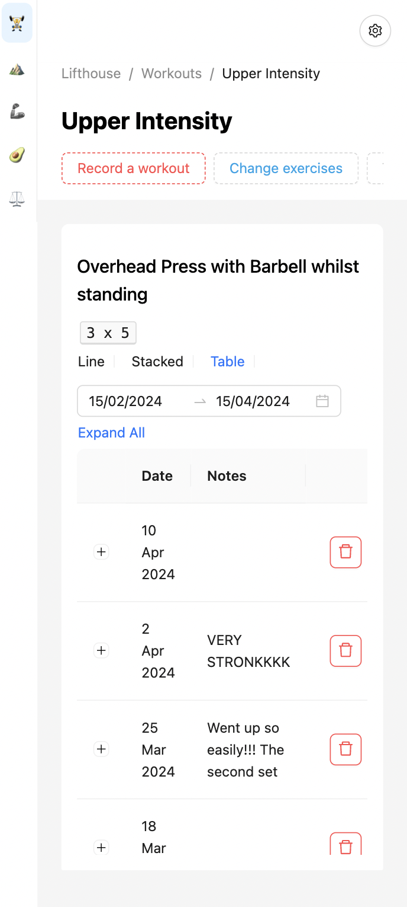
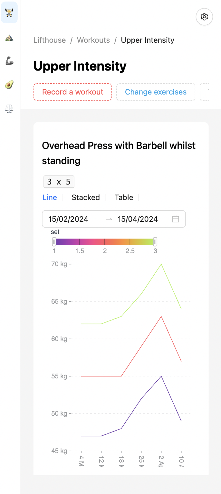

# lifthouse

This is a personal gym progress tracking app that is tailoured to the way I train. I use to use Google spreedsheets to track my progress, but I found that everything seemed so manual, so I dedicated time to create this application to streamline the same processes I do for my Google Sheets. You probably won't find this useful, or even UI/UX friendly, but it works for me :)

This application is takes the mobile-first design prinicple, so ideally you should use the application on mobile.

# Tech Stack

- React
- Supabase (using a postgres db and their authentication service)
- Vercel for deployment (which you can find [here](https://lifthouse.vercel.app/))
  - You can signup without authentication an email (for now)

# My Training

Most of my training knowledge comes from [Alex Leonidas](https://www.youtube.com/@AlexLeonidas). He advocates for strength training in various exercises such as SBD, OHP, Z-Press, Zercher Squat, Box Squats, and many more. Highly specialised training to strengthen weak points and build an naturally appleaing body (overemphasising shoulder, tricep, forearm and neck muscles or known as yoke training). My application is loosely built on exercises that he recommends and rep schemes but in no way his programme e.g. I follow a 4 day split, he recommends full body 2 day split. If you want to know more about him, I suggest going to his [website](https://outalpha.com/)

# Screenshots

## Workout Page

<table>
  <tr>
    <td align="center"></td>
    <td align="center"></td>
    <td align="center"></td>
    <td align="center"></td>
  </tr>
  <tr>
    <td align="center"></td>
    <td align="center"></td>
    <td align="center"></td>
    <td align="center"></td>
  </tr>
  <!-- Add more rows as needed -->
</table>
<table>
  <tr>
      <tr>
    <td align="center"></td>
      <td align="center"></td>
  </tr>
  </tr>
</table>

## Weight and Meals Page

<table>
  <tr>
    <td align="center"></td>
    <td align="center"></td>
  </tr>
  <tr>
    <td align="center"></td>
    <td align="center"></td>
  </tr>
  <!-- Add more rows as needed -->
</table>

## 531 Program Page

<table>
  <tr>
    <td align="center"></td>
    <td align="center"></td>
    <td align="center"></td>
  </tr>
  <!-- Add more rows as needed -->
</table>
<table>
    <tr>
    <td align="center"></td>
  </tr>
</table>

# Contributions

I don't really accept contributions for this project as it is my own personal application. But I am happy to accept UI/UX recommendations
